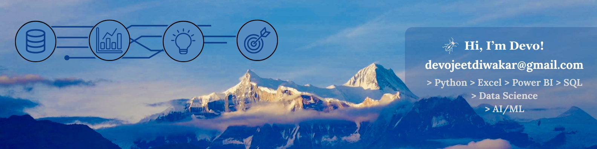

<div align="center">

<!-- ═══════════════════════════════════════════════════════════════ -->
<!--                    BANNER IMAGE AT TOP                         -->
<!-- ═══════════════════════════════════════════════════════════════ -->



<!-- 💡 NOTE: Upload your banner image (LK_Banner__1_.png) to your  -->
<!--    GitHub profile repo root so the above link works correctly.  -->

<br/>

<!-- ═══════════════════════════════════════════════════════════════ -->
<!--                    ANIMATED TYPING BANNER                      -->
<!-- ═══════════════════════════════════════════════════════════════ -->

<!DOCTYPE html>
<html lang="en">
<head>
  <meta charset="UTF-8"/>
  <meta name="viewport" content="width=device-width, initial-scale=1.0"/>
  <title>Devojeet Diwakar — Hero Section</title>
  <link rel="preconnect" href="https://fonts.googleapis.com">
  <link href="https://fonts.googleapis.com/css2?family=JetBrains+Mono:wght@400;700&display=swap" rel="stylesheet">
  <link rel="stylesheet" href="https://cdn.jsdelivr.net/npm/@tabler/icons-webfont@latest/tabler-icons.min.css">
  <style>
    *, *::before, *::after { box-sizing: border-box; margin: 0; padding: 0; }

    body {
      background: #060b18;
      display: flex;
      align-items: center;
      justify-content: center;
      min-height: 100vh;
      padding: 24px;
    }

    .hero {
      background: #0a0f1e;
      padding: 56px 32px 44px;
      font-family: 'JetBrains Mono', monospace;
      text-align: center;
      border-radius: 20px;
      border: 1px solid rgba(56, 189, 248, 0.08);
      width: 100%;
      max-width: 780px;
    }

    /* ── Hi I'm row ── */
    .hi-row {
      display: flex;
      align-items: center;
      justify-content: center;
      gap: 18px;
      margin-bottom: 12px;
    }
    .hi-line {
      width: 56px;
      height: 1.5px;
      background: #38BDF8;
    }
    .hi-text {
      color: #94a3b8;
      font-size: 15px;
      font-weight: 400;
      letter-spacing: 0.18em;
    }

    /* ── Name ── */
    .name-row {
      margin-bottom: 16px;
      line-height: 1.0;
    }
    .name-devo {
      font-size: clamp(42px, 8vw, 76px);
      font-weight: 700;
      color: #38BDF8;
      letter-spacing: -0.01em;
    }
    .name-diwakar {
      font-size: clamp(42px, 8vw, 76px);
      font-weight: 700;
      color: #ffffff;
      letter-spacing: -0.01em;
      margin-left: 16px;
    }

    /* ── Tagline ── */
    .tagline-row {
      display: flex;
      align-items: center;
      justify-content: center;
      gap: 14px;
      margin-bottom: 36px;
    }
    .tagline-bracket {
      color: #38BDF8;
      font-size: 20px;
      font-weight: 400;
      line-height: 1;
    }
    .tagline-bracket.flip {
      transform: scaleX(-1);
      display: inline-block;
    }
    .tagline-text {
      color: #475569;
      font-size: clamp(9px, 1.5vw, 12px);
      font-weight: 400;
      letter-spacing: 0.2em;
    }

    /* ── Roles box ── */
    .roles-box {
      background: rgba(255, 255, 255, 0.03);
      border: 1px solid rgba(56, 189, 248, 0.15);
      border-radius: 16px;
      padding: 6px 28px;
      max-width: 580px;
      margin: 0 auto 30px;
      cursor: default;
      transition: border-color 0.3s;
    }
    .roles-box:hover {
      border-color: rgba(56, 189, 248, 0.3);
    }

    .role-row {
      display: flex;
      align-items: center;
      justify-content: center;
      gap: 16px;
      padding: 15px 0;
      border-bottom: 1px solid rgba(56, 189, 248, 0.07);
      transition: background 0.2s;
      border-radius: 8px;
    }
    .role-row:last-child {
      border-bottom: none;
    }
    .role-row:hover {
      background: rgba(56, 189, 248, 0.04);
    }

    .role-icon {
      font-size: 22px;
      color: #38BDF8;
      width: 30px;
      text-align: center;
      flex-shrink: 0;
    }
    .role-label {
      font-size: clamp(16px, 2.8vw, 24px);
      font-weight: 400;
      color: #e2e8f0;
      width: 260px;
      text-align: left;
    }
    .role-label .hl {
      color: #38BDF8;
      font-weight: 700;
    }
    .role-bar {
      width: 2px;
      height: 30px;
      background: rgba(56, 189, 248, 0.3);
      border-radius: 2px;
      flex-shrink: 0;
    }

    /* ── Typing slot ── */
    .typing-slot {
      display: flex;
      align-items: center;
      justify-content: center;
      gap: 16px;
      padding: 15px 0;
    }
    .typing-text {
      font-size: clamp(16px, 2.8vw, 24px);
      color: #e2e8f0;
      width: 260px;
      text-align: left;
      font-family: 'JetBrains Mono', monospace;
    }
    .typing-text .hl {
      color: #38BDF8;
      font-weight: 700;
    }
    .typed-cursor {
      display: inline-block;
      width: 2px;
      height: 1em;
      background: #38BDF8;
      margin-left: 3px;
      vertical-align: middle;
      border-radius: 1px;
      animation: blink 0.85s step-end infinite;
    }
    @keyframes blink {
      0%, 100% { opacity: 1; }
      50%       { opacity: 0; }
    }

    /* ── Bottom pill ── */
    .bottom-pill {
      display: inline-flex;
      align-items: center;
      gap: 10px;
      background: rgba(255, 255, 255, 0.03);
      border: 1px solid rgba(56, 189, 248, 0.2);
      border-radius: 999px;
      padding: 11px 28px;
      margin-bottom: 36px;
      font-size: clamp(11px, 1.6vw, 13px);
      color: #94a3b8;
      letter-spacing: 0.05em;
      font-family: 'JetBrains Mono', monospace;
    }
    .pill-star {
      color: #38BDF8;
      font-size: 16px;
    }

    /* ── Skills row ── */
    .skills-row {
      display: flex;
      align-items: center;
      justify-content: center;
      flex-wrap: wrap;
      gap: 0;
    }
    .skill-item {
      display: flex;
      align-items: center;
      gap: 8px;
      padding: 8px 16px;
      color: #64748b;
      font-size: clamp(11px, 1.5vw, 13px);
      font-weight: 400;
      letter-spacing: 0.04em;
      transition: color 0.2s;
      cursor: default;
      font-family: 'JetBrains Mono', monospace;
    }
    .skill-item:hover { color: #e2e8f0; }
    .skill-divider {
      width: 1px;
      height: 18px;
      background: rgba(56, 189, 248, 0.18);
    }
    .skill-icon {
      width: 20px;
      height: 20px;
      flex-shrink: 0;
    }

    /* ── Hover hint ── */
    .hover-hint {
      margin-top: 20px;
      font-size: 11px;
      color: #1e293b;
      letter-spacing: 0.1em;
      font-family: 'JetBrains Mono', monospace;
      transition: color 0.3s;
    }
    .roles-box:hover ~ .hover-hint,
    .roles-box:hover + * .hover-hint {
      color: #475569;
    }
  </style>
</head>
<body>

<div class="hero">

  <!-- Hi I'm -->
  <div class="hi-row">
    <div class="hi-line"></div>
    <span class="hi-text">Hi, I'm</span>
    <div class="hi-line"></div>
  </div>

  <!-- Name -->
  <div class="name-row">
    <span class="name-devo">DEVOJEET</span><span class="name-diwakar">DIWAKAR</span>
  </div>

  <!-- Tagline -->
  <div class="tagline-row">
    <span class="tagline-bracket">⌐</span>
    <span class="tagline-text">TRANSFORMING DATA INTO DECISIONS. POWERING INTELLIGENCE WITH AI &amp; ML.</span>
    <span class="tagline-bracket flip">⌐</span>
  </div>

  <!-- Roles Card -->
  <div class="roles-box" id="rolesBox">

    <!-- Static previous roles (shown as typed history) -->
    <div class="role-row" id="slot0" style="display:none">
      <div class="role-icon"><i class="ti ti-chart-bar"></i></div>
      <div class="role-label"><span class="hl" id="slot0hl"></span><span id="slot0rest"></span></div>
      <div class="role-bar"></div>
    </div>
    <div class="role-row" id="slot1" style="display:none">
      <div class="role-icon"><i class="ti ti-briefcase" id="slot1icon"></i></div>
      <div class="role-label"><span class="hl" id="slot1hl"></span><span id="slot1rest"></span></div>
      <div class="role-bar"></div>
    </div>
    <div class="role-row" id="slot2" style="display:none">
      <div class="role-icon"><i class="ti ti-database" id="slot2icon"></i></div>
      <div class="role-label"><span class="hl" id="slot2hl"></span><span id="slot2rest"></span></div>
      <div class="role-bar"></div>
    </div>

    <!-- Typing slot -->
    <div class="typing-slot">
      <div class="role-icon" id="typingIcon"><i class="ti ti-brain"></i></div>
      <div class="typing-text">
        <span class="hl" id="typedHl"></span><span id="typedRest"></span><span class="typed-cursor"></span>
      </div>
      <div class="role-bar"></div>
    </div>

  </div>

  <!-- Bottom pill -->
  <div>
    <div class="bottom-pill">
      <span class="pill-star">✦</span>
      Turning Data into Insights. Building Intelligent Solutions.
    </div>
  </div>

  <!-- Skills -->
  <div class="skills-row">

    <div class="skill-item">
      <svg class="skill-icon" viewBox="0 0 24 24" fill="none">
        <rect width="24" height="24" rx="4" fill="#3776AB"/>
        <path d="M12 4C8.1 4 8.4 5.6 8.4 5.6L8.41 7.26H12.06V7.76H6.97C6.97 7.76 4 7.43 4 11.36C4 15.29 6.65 15.16 6.65 15.16H8.28V13.42C8.28 13.42 8.19 10.77 10.88 10.77H14.5C14.5 10.77 17.03 10.81 17.03 8.33V5.96C17.03 5.96 17.43 4 12 4ZM10.74 5.01C11.19 5.01 11.56 5.38 11.56 5.83C11.56 6.28 11.19 6.65 10.74 6.65C10.29 6.65 9.92 6.28 9.92 5.83C9.92 5.38 10.29 5.01 10.74 5.01Z" fill="white"/>
        <path d="M12 20C15.9 20 15.6 18.4 15.6 18.4L15.59 16.74H11.94V16.24H17.03C17.03 16.24 20 16.57 20 12.64C20 8.71 17.35 8.84 17.35 8.84H15.72V10.58C15.72 10.58 15.81 13.23 13.12 13.23H9.5C9.5 13.23 6.97 13.19 6.97 15.67V18.04C6.97 18.04 6.57 20 12 20ZM13.26 18.99C12.81 18.99 12.44 18.62 12.44 18.17C12.44 17.72 12.81 17.35 13.26 17.35C13.71 17.35 14.08 17.72 14.08 18.17C14.08 18.62 13.71 18.99 13.26 18.99Z" fill="#FFD43B"/>
      </svg>
      Python
    </div>

    <div class="skill-divider"></div>

    <div class="skill-item">
      <svg class="skill-icon" viewBox="0 0 24 24" fill="none">
        <rect width="24" height="24" rx="4" fill="#336791"/>
        <path d="M12 4.5C9 4.5 5.5 5.5 5.5 8.5C5.5 10.5 6.8 11.8 8.5 12.5V17C8.5 17.3 8.7 17.5 9 17.5C9.15 17.5 9.28 17.44 9.38 17.34L11 15.5L13.2 18.2C13.32 18.38 13.52 18.5 13.75 18.5C13.82 18.5 13.88 18.49 13.94 18.47C14.22 18.37 14.42 18.1 14.42 17.8V12.45C16.1 11.72 18.5 10.3 18.5 8.5C18.5 5.5 15 4.5 12 4.5Z" fill="white" opacity="0.85"/>
        <circle cx="9.5" cy="9" r="1.1" fill="#336791"/>
        <circle cx="14.5" cy="9" r="1.1" fill="#336791"/>
      </svg>
      SQL
    </div>

    <div class="skill-divider"></div>

    <div class="skill-item">
      <svg class="skill-icon" viewBox="0 0 24 24" fill="none">
        <rect width="24" height="24" rx="4" fill="#F2C811"/>
        <rect x="4" y="5" width="9" height="6" fill="#1a1a1a"/>
        <rect x="14" y="5" width="6" height="4" fill="#1a1a1a"/>
        <rect x="14" y="10" width="6" height="5" fill="#1a1a1a"/>
        <rect x="4" y="12" width="9" height="7" fill="#1a1a1a"/>
      </svg>
      Power BI
    </div>

    <div class="skill-divider"></div>

    <div class="skill-item">
      <svg class="skill-icon" viewBox="0 0 24 24" fill="none">
        <rect width="24" height="24" rx="4" fill="#217346"/>
        <path d="M7 8.5L11 12L7 15.5M12 15.5H18" stroke="white" stroke-width="2" stroke-linecap="round" stroke-linejoin="round"/>
      </svg>
      Excel
    </div>

    <div class="skill-divider"></div>

    <div class="skill-item">
      <svg class="skill-icon" viewBox="0 0 24 24" fill="none">
        <rect width="24" height="24" rx="4" fill="#0f172a"/>
        <circle cx="12" cy="12" r="6.5" stroke="#38BDF8" stroke-width="1.4"/>
        <ellipse cx="12" cy="12" rx="3" ry="6.5" stroke="#38BDF8" stroke-width="1.2"/>
        <line x1="5.5" y1="12" x2="18.5" y2="12" stroke="#38BDF8" stroke-width="1.2"/>
        <circle cx="12" cy="12" r="1.8" fill="#38BDF8"/>
      </svg>
      Machine Learning
    </div>

    <div class="skill-divider"></div>

    <div class="skill-item">
      <svg class="skill-icon" viewBox="0 0 24 24" fill="none">
        <rect width="24" height="24" rx="4" fill="#0f172a"/>
        <circle cx="6"  cy="7"  r="1.6" fill="#38BDF8"/>
        <circle cx="12" cy="4"  r="1.6" fill="#38BDF8"/>
        <circle cx="18" cy="7"  r="1.6" fill="#38BDF8"/>
        <circle cx="6"  cy="17" r="1.6" fill="#7DD3FC"/>
        <circle cx="12" cy="20" r="1.6" fill="#7DD3FC"/>
        <circle cx="18" cy="17" r="1.6" fill="#7DD3FC"/>
        <line x1="6"  y1="7"  x2="12" y2="4"  stroke="#38BDF8" stroke-width="1.1"/>
        <line x1="12" y1="4"  x2="18" y2="7"  stroke="#38BDF8" stroke-width="1.1"/>
        <line x1="6"  y1="7"  x2="6"  y2="17" stroke="#7DD3FC" stroke-width="1.1"/>
        <line x1="18" y1="7"  x2="18" y2="17" stroke="#7DD3FC" stroke-width="1.1"/>
        <line x1="6"  y1="17" x2="12" y2="20" stroke="#7DD3FC" stroke-width="1.1"/>
        <line x1="12" y1="20" x2="18" y2="17" stroke="#7DD3FC" stroke-width="1.1"/>
        <line x1="6"  y1="7"  x2="18" y2="17" stroke="#94a3b8" stroke-width="0.8" stroke-dasharray="2,2"/>
        <line x1="18" y1="7"  x2="6"  y2="17" stroke="#94a3b8" stroke-width="0.8" stroke-dasharray="2,2"/>
      </svg>
      Deep Learning
    </div>

    <div class="skill-divider"></div>

    <div class="skill-item">
      <svg class="skill-icon" viewBox="0 0 24 24" fill="none">
        <rect width="24" height="24" rx="4" fill="#0f172a"/>
        <rect x="4" y="4" width="7" height="8" rx="2" fill="#A259FF"/>
        <rect x="4" y="13" width="7" height="7" rx="2" fill="#F24E1E"/>
        <rect x="13" y="4" width="7" height="7" rx="2" fill="#FF7262"/>
        <circle cx="16.5" cy="15.5" r="3.5" fill="none" stroke="#1ABCFE" stroke-width="2"/>
      </svg>
      Figma
    </div>

  </div>

  <div class="hover-hint" id="hoverHint">hover the card to pause · resume on leave</div>

</div>

<script>
  const roles = [
    { icon: 'ti-brain',     hl: 'AI & ML',   rest: ' Engineer'  },
    { icon: 'ti-chart-bar', hl: 'Data',       rest: ' Analyst'   },
    { icon: 'ti-briefcase', hl: 'Business',   rest: ' Analyst'   },
    { icon: 'ti-database',  hl: 'Data',       rest: ' Scientist' },
  ];

  const slotEls = [
    { row: document.getElementById('slot0'), hl: document.getElementById('slot0hl'), rest: document.getElementById('slot0rest') },
    { row: document.getElementById('slot1'), hl: document.getElementById('slot1hl'), rest: document.getElementById('slot1rest') },
    { row: document.getElementById('slot2'), hl: document.getElementById('slot2hl'), rest: document.getElementById('slot2rest') },
  ];

  const typingIcon = document.getElementById('typingIcon');
  const typedHl   = document.getElementById('typedHl');
  const typedRest = document.getElementById('typedRest');
  const rolesBox  = document.getElementById('rolesBox');
  const hoverHint = document.getElementById('hoverHint');

  let roleIdx = 0, charIdx = 0, isDeleting = false, paused = false, timer = null;

  const TYPE_SPEED   = 65;
  const DEL_SPEED    = 35;
  const PAUSE_TYPED  = 1900;
  const PAUSE_DEL    = 220;

  function updateSlots(currentIdx) {
    const history = [];
    for (let i = 3; i >= 1; i--) {
      history.push(roles[(currentIdx - i + roles.length) % roles.length]);
    }
    slotEls.forEach((el, i) => {
      const r = history[i];
      if (r) {
        el.row.style.display = 'flex';
        el.hl.textContent   = r.hl;
        el.rest.textContent = r.rest;
        el.row.querySelector('.role-icon').innerHTML = `<i class="ti ${r.icon}"></i>`;
      } else {
        el.row.style.display = 'none';
      }
    });
  }

  function tick() {
    if (paused) return;
    const cur      = roles[roleIdx];
    const fullText = cur.hl + cur.rest;

    if (!isDeleting) {
      charIdx++;
      const typed = fullText.slice(0, charIdx);
      typedHl.textContent   = typed.slice(0, cur.hl.length);
      typedRest.textContent = typed.slice(cur.hl.length);
      typingIcon.innerHTML  = `<i class="ti ${cur.icon}"></i>`;

      if (charIdx === fullText.length) {
        isDeleting = true;
        timer = setTimeout(tick, PAUSE_TYPED);
        return;
      }
      timer = setTimeout(tick, TYPE_SPEED);

    } else {
      charIdx--;
      const typed = fullText.slice(0, charIdx);
      typedHl.textContent   = typed.slice(0, Math.min(typed.length, cur.hl.length));
      typedRest.textContent = typed.slice(cur.hl.length);

      if (charIdx === 0) {
        isDeleting = false;
        roleIdx = (roleIdx + 1) % roles.length;
        updateSlots(roleIdx);
        timer = setTimeout(tick, PAUSE_DEL);
        return;
      }
      timer = setTimeout(tick, DEL_SPEED);
    }
  }

  rolesBox.addEventListener('mouseenter', () => {
    paused = true;
    clearTimeout(timer);
    hoverHint.style.color = '#38BDF8';
    hoverHint.textContent = 'paused — move cursor away to resume';
  });
  rolesBox.addEventListener('mouseleave', () => {
    paused = false;
    hoverHint.style.color = '#1e293b';
    hoverHint.textContent = 'hover the card to pause · resume on leave';
    tick();
  });

  updateSlots(0);
  tick();
</script>

</body>
</html>


<br/>

<!-- ═══════════════════════════════════════════════════════════════ -->
<!--                     IDENTITY BADGES                            -->
<!-- ═══════════════════════════════════════════════════════════════ -->

<p>
  
  &nbsp;
  
  &nbsp;
  
  &nbsp;
  
</p>

<!-- ═══════════════════════════════════════════════════════════════ -->
<!--                    SOCIAL / CONTACT LINKS                      -->
<!-- ═══════════════════════════════════════════════════════════════ -->

<p>
  <a href="mailto:devojeetdiwakar@gmail.com">
    
  </a>
  &nbsp;
  <a href="https://www.linkedin.com/in/devojeet-diwakar-694278266/" target="_blank">
    
  </a>
  &nbsp;
  <a href="https://github.com/devojeetdiwakar" target="_blank">
    
  </a>
  &nbsp;
  <!-- ✏️ ADD PORTFOLIO LINK BELOW WHEN READY -->
  <!-- <a href="YOUR_PORTFOLIO_URL" target="_blank">
    
  </a> -->
</p>

<p>
  
  &nbsp;
  
  &nbsp;
  
</p>

</div>

<br/>

---

## 👨‍💻 About Me

I'm a **Data Scientist** and **AI/ML Engineer** currently in my final year of B.Tech in Computer Science at **Amity University Uttar Pradesh, Lucknow Campus (2022–26)**.

My most significant experience has been as a **Research & AI/ML Intern at DRDO, RCMA**, where I worked on real-world defence-grade data and intelligent systems. That experience sharpened my ability to translate raw, complex data into meaningful insights and production-ready models.

I operate at the intersection of **Data Analytics**, **Machine Learning**, and **Python Engineering** — building pipelines and models that don't just look good on paper but actually work in deployment.

I combine analytical rigor with a hands-on engineering mindset, and I'm actively looking for opportunities where I can contribute to data-driven products and AI systems.

**Open to:** Data Scientist · AI/ML Engineer · Data Analyst · Python Developer Roles

---

## 🛠️ Tech Stack

### Languages
<p>
  
</p>

### Data Science & ML
<p>
  
  &nbsp;
  
  
  
  
  
</p>

### Analytics & BI Tools
<p>
  
  &nbsp;
  
  &nbsp;
  
  &nbsp;
  
</p>

### Databases & Backend
<p>
  
</p>

### Cloud & DevOps
<p>
  
</p>

<!-- ✏️ ADD OR REMOVE any tools above that don't match your actual stack -->

---

## 🤖 AI / ML Expertise

| Domain | Proficiency | Details |
|---|---|---|
| **Data Analytics** | Expert | EDA, statistical analysis, business intelligence dashboards |
| **Machine Learning** | Advanced | Supervised/unsupervised learning, model evaluation, tuning |
| **Deep Learning** | Intermediate | Neural networks, CNNs, sequence models |
| **Natural Language Processing** | Intermediate | Text classification, entity extraction, LLM API integration |
| **Data Visualisation** | Advanced | Power BI, Matplotlib, Seaborn, Plotly |
| **Python Engineering** | Expert | Scripting, automation, data pipelines |
| **AWS AI/Cloud** | Intermediate | S3, EC2, SageMaker basics |

<!-- ✏️ UPDATE proficiency levels and details to match your actual experience -->

---

## 🚀 Featured Projects

<!-- ═══════════════════════════════════════════════════════════════ -->
<!--              ✏️ ADD YOUR PROJECTS BELOW                        -->
<!--  For each project copy one <details> block and fill in:        -->
<!--   - Project Name                                               -->
<!--   - Tech Stack used                                            -->
<!--   - What it does (2-3 lines)                                   -->
<!--   - Key metrics (accuracy %, users, records processed, etc.)   -->
<!--   - GitHub repo link                                           -->
<!-- ═══════════════════════════════════════════════════════════════ -->

<details>
<summary><b>🔬 Project 1 — [ADD PROJECT NAME HERE]</b></summary>

<br/>

> <!-- ADD a one-line description of what this project is -->

| Attribute | Detail |
|---|---|
| **Stack** | <!-- e.g. Python · Pandas · Scikit-Learn · Power BI --> |
| **Scale** | <!-- e.g. 10,000+ records processed --> |
| **Accuracy** | <!-- e.g. 94% model accuracy --> |
| **Impact** | <!-- e.g. 40% reduction in manual effort --> |
| **Repository** | <!-- [github.com/devojeetdiwakar/project-name](LINK) --> |

**What it does:** <!-- Describe the problem, your approach, and the outcome in 2-3 sentences. -->

</details>

<details>
<summary><b>📊 Project 2 — [ADD PROJECT NAME HERE]</b></summary>

<br/>

> <!-- ADD a one-line description -->

| Attribute | Detail |
|---|---|
| **Stack** | <!-- e.g. Python · SQL · Power BI · Excel --> |
| **Scale** | <!-- e.g. Dashboard with 5+ KPIs --> |
| **Impact** | <!-- e.g. Adopted by 3 internal teams --> |
| **Repository** | <!-- [github.com/devojeetdiwakar/project-name](LINK) --> |

**What it does:** <!-- Describe in 2-3 sentences. -->

</details>

<details>
<summary><b>🤖 Project 3 — [ADD PROJECT NAME HERE]</b></summary>

<br/>

> <!-- ADD a one-line description -->

| Attribute | Detail |
|---|---|
| **Stack** | <!-- e.g. Python · TensorFlow · NLP --> |
| **Scale** | <!-- ADD metric --> |
| **Accuracy** | <!-- ADD metric --> |
| **Repository** | <!-- ADD link --> |

**What it does:** <!-- Describe in 2-3 sentences. -->

</details>

<!-- ✏️ COPY ANOTHER <details> BLOCK ABOVE TO ADD MORE PROJECTS -->

---

## 💼 Experience

### Research & AI/ML Intern — DRDO, RCMA

`<!-- ✏️ ADD your internship start date --> – <!-- ADD end date -->`

Worked within a research division of the **Defence Research and Development Organisation (DRDO)** on applied AI and machine learning problems in a real-world defence context. Contributed to data-driven research, model development, and analytical workflows under defence-grade constraints.

**Scope of work:**
- <!-- ✏️ ADD specific task 1, e.g. "Built ML pipelines to classify sensor data with X% accuracy" -->
- <!-- ✏️ ADD specific task 2 -->
- <!-- ✏️ ADD specific task 3 -->
- <!-- ✏️ ADD specific task 4 -->

`Python` `Machine Learning` `Data Analytics` `<!-- ADD more tools -->`

---

## 🏆 Achievements

<div align="center">

<!-- ═══════════════════════════════════════════════════════════════ -->
<!--              ✏️ FILL IN YOUR ACHIEVEMENTS BELOW               -->
<!--  Add hackathons, competitions, rankings, awards, etc.          -->
<!-- ═══════════════════════════════════════════════════════════════ -->

| Recognition | Details |
|---|---|
| <!-- ADD Achievement 1 --> | <!-- e.g. Finalist — XYZ Hackathon 2024 --> |
| <!-- ADD Achievement 2 --> | <!-- e.g. Top 5% on LeetCode --> |
| <!-- ADD Achievement 3 --> | <!-- ADD details --> |
| <!-- ADD Achievement 4 --> | <!-- ADD details --> |
| **CSE Achiever** | 8.55 CGPA · Amity University UP Lucknow |

</div>

---

## 📜 Certifications

<div align="center">

<!-- ═══════════════════════════════════════════════════════════════ -->
<!--              ✏️ ADD YOUR CERTIFICATIONS BELOW                  -->
<!--  Copy the badge format below and replace details               -->
<!--  Badge generator: https://shields.io/                          -->
<!-- ═══════════════════════════════════════════════════════════════ -->

**Amazon Web Services**


<br/>

**<!-- ADD CERTIFICATION PROVIDER -->**


<br/>

**<!-- ADD ANOTHER PROVIDER -->**


<!-- ✏️ COPY BADGE LINES ABOVE TO ADD MORE CERTIFICATIONS -->

</div>

---

## 💻 Coding Profiles

<div align="center">

<!-- ✏️ REPLACE # with your actual profile URLs below -->

<a href="https://leetcode.com/devojeetdiwakar/" target="_blank">
  +_Problems-FFA116?style=for-the-badge&logo=leetcode&logoColor=black"/>
</a>
&nbsp;
<a href="https://geeksforgeeks.org/user/<!-- ADD GFG username -->/" target="_blank">
  +_Problems-2F8D46?style=for-the-badge&logo=geeksforgeeks&logoColor=white"/>
</a>
&nbsp;
<a href="https://hackerrank.com/profile/<!-- ADD HackerRank username -->" target="_blank">
  
</a>
&nbsp;
<a href="https://kaggle.com/<!-- ADD Kaggle username -->" target="_blank">
  
</a>

<!-- ✏️ ADD OR REMOVE platforms above that you're active on -->

</div>

---

## 📊 GitHub Analytics

<div align="center">


&nbsp;


<br/><br/>


</div>

---

## 🏅 GitHub Trophies

<div align="center">


</div>

---

## 📈 Contribution Activity

<div align="center">


</div>

<div align="center">


</div>

---

## 🎯 Current Focus

```yaml
Learning:
  - Advanced Machine Learning & Deep Learning
  - Large Language Models & RAG pipelines
  - Cloud Engineering on AWS (SageMaker, Bedrock, Lambda)
  - System Design & Scalable Data Architectures

Building:
  - AI-powered data analysis tools
  - End-to-end ML pipelines for real-world datasets
  - Data dashboards and BI solutions

Exploring:
  - Generative AI and LLM fine-tuning
  - MLOps and model deployment practices
  - Open source contributions in data science

Open To:
  - Data Scientist roles at product-first companies
  - AI / ML Engineer opportunities
  - Research collaborations
  - Data Analyst positions
```

<!-- ✏️ UPDATE the yaml above to reflect what you're currently working on -->

---

## 🤝 Connect With Me

<div align="center">

<a href="mailto:devojeetdiwakar@gmail.com">
  
</a>
&nbsp;
<a href="https://www.linkedin.com/in/devojeet-diwakar-694278266/" target="_blank">
  
</a>
&nbsp;
<a href="https://github.com/devojeetdiwakar" target="_blank">
  
</a>

<!-- ✏️ UNCOMMENT AND ADD YOUR PORTFOLIO LINK WHEN READY -->
<!-- &nbsp;
<a href="YOUR_PORTFOLIO_URL" target="_blank">
  
</a> -->

</div>

<br/>

<div align="center">

*Turning data into decisions — one model at a time.*


</div>
